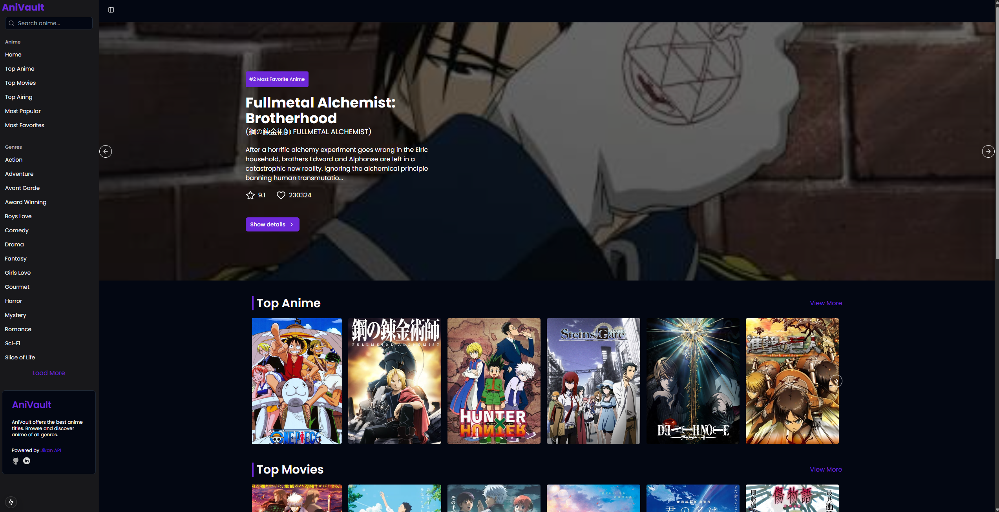

# AniVault

AniVault offers the best anime titles. Browse and discover anime
of all genres.



## TechStack

- Nextjs
- Typescript
- ShadCDN
- Tailwind CSS
- React Query
- Axios

## Key Features

- Top Anime
- Top Airing
- Top Upcoming
- Top Movies
- Top Characters
- Most Popular
- Most Favorites
- Anime by Genre
- Search
- Responsive Design

## Prerequisites

- Node.js
- npm or yarn or pnpm or bun for package management

## Installation

1. Clone the repository

```bash
https://github.com/vjvic/anivault.git

```

2.  Navigate to project directory

```bash
cd anivault

```

3. Install the dependencies:

```bash
npm install

```

## Usage

1. Start the development server

```bash
npm run dev

```

2. Access the application in your browser at http://localhost:3000.
